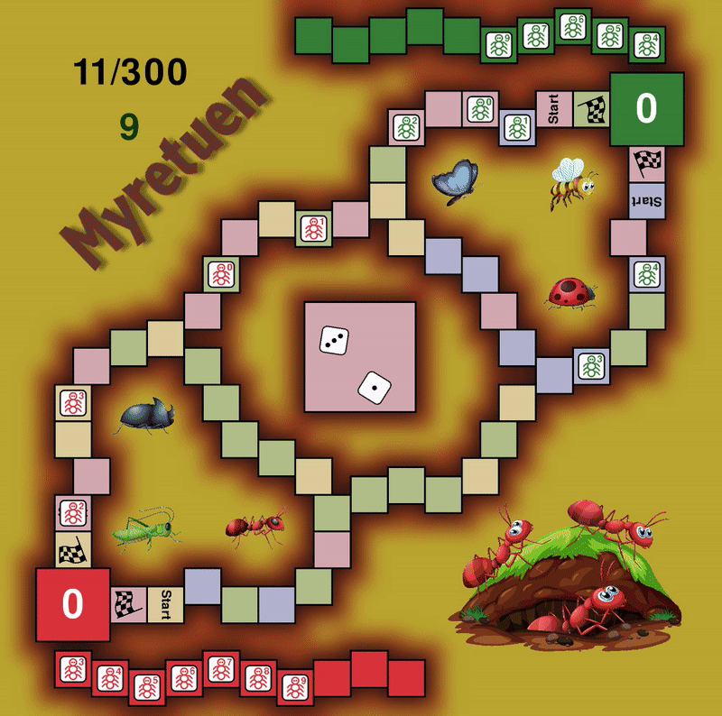

# Myretuen

Project of creating the board game Myretuen and create an AI to play the game.
Welcome

# Requirements

```bash
python -m pip install torch torchvision
```

```bash
python -m pip install pygame
```

```bash
python -m pip install gym
```

```bash
python -m pip install matplotlib
```

# Using the enviroment

## Initialize

```python
from game import Myretuen, Controller

env = Myretuen()
```

## Get the agents

```python
from agents import *

agent1 = Opponent(RandomAgent())
agent2 = NNAgent()
```

## Start the controller

```python
controller = Controller(env=env, agent1=agent1, agent2=agent2)
controller.run()
```

## The UI

<p align="center">
  
</p>

 <p align="center"><a href="https://www.youtube.com/watch?v=NSDqPQURoyc&list=PLTj3aUqRD0-MPQeFJscACMaoKomZgW16P">Videoes of game</a></p>
[Videoes of game](https://www.youtube.com/watch?v=NSDqPQURoyc&list=PLTj3aUqRD0-MPQeFJscACMaoKomZgW16P "YouTube.com")
# Versions

## version-0.6

- New Fruit-mode
- Monto Carlo Search
- Bugs fixes and improvements

## version-0.5

- Added Boltzmann Approach to the explorer
- Changes Elo system to be absolute
- Impala is now batch training

## version-0.4

- Feature and reward improvements
- Added probaility calculations
- Added an Elo system
- Added impala

## version-0.3

- Added explorer mode
- Added TD(lambda)
- Added self play option

## version-0.2

- Speed improvements
- Simple Lionear model added
- Neural Network model added

## version-0.1

- One linear model
- Most basic feateres implemented

# Attributions

[Ants Vectors by Vecteezy](https://www.vecteezy.com/free-vector/ants "Vecteezy.com")

[Foods Vectors by Vecteezy](https://www.vecteezy.com/free-vector/food "Vecteezy.com")

[Fonts by Fontmeme](https://fontmeme.com/ "Fontmeme.com")
